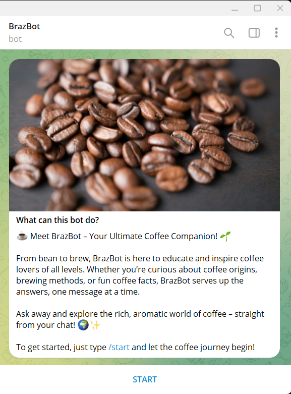

# BrazBot

[](https://youtu.be/HUqXdk3M7cQ)
BrazBot Video

BrazBot is an interactive Telegram bot dedicated to educating users about coffee through the lens of agribusiness. It provides valuable insights into farming equipment, crop management, sustainable agriculture, and much more. Whether you're a coffee enthusiast, a farmer, or someone curious about coffee's journey from crop to cup, BrazBot has you covered.

## Features

BrazBot offers a range of sections to explore:
- **About Coffee**: Dive into the history, culture, and science behind coffee.
- **Brewing Methods**: Learn how to brew the perfect cup with different techniques like espresso, pour-over, and French press.
- **Coffee Facts**: Discover fascinating trivia and lesser-known facts about coffee.
- **Coffee Origins**: Explore the global journey of coffee from seed to cup.
- **Coffee Types**: Understand the differences between Arabica, Robusta, and other varieties.
- **Definitions**: Learn coffee-related terminology and jargon.
- **Equipment**: Get insights into essential tools for brewing and farming.
- **Feedback**: Share your thoughts and help us improve BrazBot.
- **Help**: Access detailed guidance on using the bot.
- **Coffee Recipes**: Try out creative recipes for coffee-based drinks and desserts.
- **Tips**: Gain valuable advice on coffee farming, brewing, and sustainable practices.

## Installation

To get started with BrazBot, follow these simple steps:

1. Clone the repository:
   ```bash
   git clone https://github.com/mumiaktech/brazbot.git
   cd brazbot
   ```

## Telegram Integration

- **Username**: [BrazEduBot](https://t.me/BrazEduBot)  
- **Name**: BrazBot  

Simply search for "BrazEduBot" on Telegram to start interacting with BrazBot.


## Hosting

BrazBot is currently hosted on Render, which provides convenient deployment options. Note the following:
- It is using a free instance on Render which may experience spin-down due to inactivity.
- This could result in delayed requests (up to 50 seconds or more).

For a more robust hosting experience, consider upgrading to a paid instance or using an alternative hosting platform.


## Contributing

We welcome contributions! To contribute:
1. Fork the repository.
2. Create a new branch:
   ```bash
   git checkout -b feature/your-feature-name
   ```
3. Make your changes and commit them:
   ```bash
   git commit -m "Add your message here"
   ```
4. Push to the branch:
   ```bash
   git push origin feature/your-feature-name
   ```
5. Submit a pull request.

## Feedback

Your feedback is crucial to making BrazBot better. If you encounter any issues or have feature requests, please open an issue or reach out via the feedback section of the bot.

## License

This project is licensed under the MIT License. See the `LICENSE` file for details.


